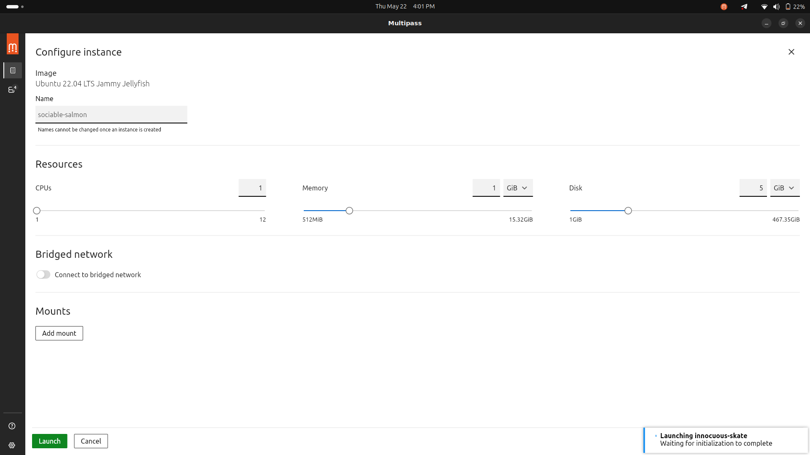

# Multipass Setup Guide

## Installation

Install Multipass using Snap:

```bash
sudo snap install multipass
```

## Configure Bridge Networking

In the Multipass GUI, navigate to **Settings > Network** and select a bridge network interface.


## Launch a Virtual Machine

From the **Catalogue** section, choose an Ubuntu version and configure the desired CPU, RAM, and disk settings.



## SSH Access

After the VM is created:

1. Add your SSH public key to the VM:

   ```bash
   echo "<your-public-key>" >> ~/.ssh/authorized_keys
   ```

2. You can now SSH into the VM from your local system:

   ```bash
   ssh <vm-username>@<vm-ip>
   ```


## Setting Up a Desktop Environment

Refer to the official guide: [Using a Desktop in Multipass](https://discourse.ubuntu.com/t/how-to-use-a-desktop-in-multipass/16229)

The images used by Multipass do not come with a graphical desktop installed. For this reason, a desktop environment must be installed (we use `ubuntu-desktop` but there are as many other options as flavors of Ubuntu exist), along with the RDP server (we will use here `xrdp` but there are also other options such as `freerdp`).

To install a desktop environment:

1. SSH into the Multipass instance:

   ```bash
   ssh <vm-username>@<vm-ip>
   ```

2. Update packages and install `ubuntu-desktop` and `xrdp`:

   ```bash
   sudo apt update
   sudo apt install ubuntu-desktop xrdp
   ```

3. Set a password for the default user (e.g., `ubuntu`):

   ```bash
   sudo passwd ubuntu
   ```

On Linux, there are applications such as Remmina to visualize the desktop (make sure the package `remmina-plugin-rdp` is installed in your host along with `remmina`, and that username and password are specified using the **New connection profile** button in the top left of the window). 

[Setup Remmina in Ubuntu](https://github.com/chmodshubham/remmina)